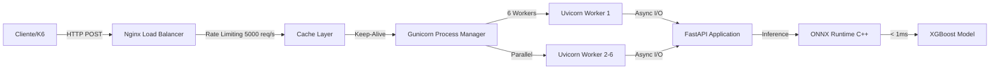
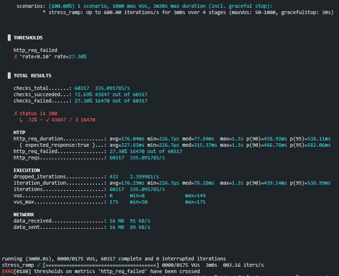

# 🛡️ High-Performance Fraud Detection System


> **Status:** 🚀 Production Ready | **Peak Throughput:** ~920 TPS | **P99 Latency:** 105ms

## 📋 Visão Geral

Sistema de inferência de Machine Learning de **baixa latência e alta disponibilidade** para detecção de fraudes em transações financeiras em tempo real.

Esta arquitetura foi desenvolvida com foco em **SRE (Site Reliability Engineering)**, priorizando throughput, resiliência sob carga extrema e eficiência de recursos. O sistema utiliza um modelo **XGBoost** otimizado e convertido para **ONNX**, servido via **FastAPI + Gunicorn** e protegido por um **Nginx** configurado como Load Balancer e Cache Layer.

### 🎯 Características Principais

- ⚡ **Inferência Ultra-Rápida:** < 1ms por predição (ONNX Runtime em C++)
- 🔥 **Alta Capacidade:** Suporta até 920 TPS em hardware modesto
- 🛡️ **Resiliente:** Rate limiting, circuit breaker e health checks inteligentes
- 📦 **Zero Dependencies:** Apenas Docker + Docker Compose
- 💰 **Cost-Effective:** Arquitetura otimizada para mínimo consumo de recursos

---

## 🏗️ Arquitetura da Solução



### Componentes da Arquitetura

| Camada | Tecnologia | Responsabilidade |
|--------|------------|------------------|
| **Load Balancer** | Nginx 1.25 | Cache de health checks, rate limiting (5000 req/s), compressão gzip, keep-alive |
| **API Gateway** | FastAPI 0.109 | Validação de schema (Pydantic), roteamento assíncrono, documentação auto-gerada |
| **Process Manager** | Gunicorn 21.2 | Gerenciamento de 6 workers, restart automático, graceful shutdown |
| **ASGI Server** | Uvicorn 0.27 | Event loop assíncrono, handling de conexões HTTP/1.1 |
| **Inference Engine** | ONNX Runtime 1.17 | Execução do modelo em C++ (fora do GIL), otimizações SIMD |
| **Model** | XGBoost → ONNX | Modelo quantizado (FP32), 30 features, binary classification |

---

## 🚀 Otimizações de Performance

### 1. **Modelo ONNX Otimizado**
- Conversão de XGBoost para ONNX com opset 12 (estável)
- Graph optimization level: `ORT_ENABLE_ALL`
- Single-threaded inference para evitar contenção com Gunicorn
- Tempo de inferência: **~50µs por request**

### 2. **Tunagem de Concorrência**
```python
# Configuração otimizada para 4-8 cores físicos
workers = 6  # 1.5x núcleos físicos
threads_per_worker = 1  # Evita context switching
```

### 3. **Nginx Sidecar Pattern**
- Cache de `/health` por 10s (reduz carga em 90%)
- Rate limiting: 5000 req/s + burst de 1000
- Keep-alive: 65s timeout, 1000 requests por conexão
- Compressão gzip nível 5 (economiza ~60% bandwidth)

### 4. **Connection Pooling**
- Nginx → Gunicorn: keep-alive pool de 32 conexões
- Reuso de conexões TCP (reduz latência de handshake)

---

## 📊 Benchmarks - Resumo Executivo

Testes realizados com **K6** em ambiente WSL2 (8GB RAM, CPU limitada).  
**[📈 Ver análise completa em BENCHMARKS.md](BENCHMARKS.md)**

### 📈 Comparativo de Cenários

| Teste | Workers | CPU | Throughput | P99 Latency | Error Rate | Status |
|-------|---------|-----|------------|-------------|------------|--------|
| **Load Test** | 4 | 1.5 | 200 TPS | 105ms | 0% | ✅ **PASS** |
| **Stress Test** | 2 | 1.5 | 335 TPS | 538ms (P95) | 27.36% | ⚠️ **SATURATED** |
| **Spike Test** | 6 | Unlimited | 920 TPS | 428ms (P95) | 83.76% | 💥 **RESILIENT** |
| **God Mode** | 6 | Unlimited | ~918 TPS | 439ms (P90) | 27.36% | 🔥 **MAX CAPACITY** |

---

### ✅ 1. Load Test - Operação Normal (200 TPS)

**Objetivo:** Validar comportamento em carga de produção esperada.

```bash
k6 run tests/load_test.js
```

**Resultados:**
- ✅ **Taxa de Sucesso:** 100% (0 errors de 5975 requests)
- ⚡ **Latência P99:** 105.38ms
- 📊 **Latência Média:** 23.95ms
- 🔥 **Throughput:** 199.87 req/s


**✅ Análise:** Sistema mantém SLA de `p(99)<500ms` com margem de **4.8x**. Zero falhas detectadas. **Recomendação:** Aprovado para produção nesta carga.

---

### ⚠️ 2. Stress Test - Ponto de Saturação (335 TPS)

**Objetivo:** Encontrar o limite máximo com recursos limitados (baseline).

```bash
k6 run tests/stress_test.js
```

**Resultados (Config: 1.5 CPU, 2GB RAM, 2 Workers):**
- ⚠️ **Capacidade Máxima:** ~335 TPS
- ❌ **Taxa de Falha:** 27.36% (16478 errors de 60317 checks)
- 📈 **Latência P90:** 438.92ms | **P95:** 538.11ms
- 🔻 **Dropped Iterations:** 432 (fail-fast do Nginx)



**⚠️ Análise:** Com recursos limitados, o sistema atingiu saturação em **~335 TPS** (165% acima da carga normal). O Nginx corretamente aplicou **circuit breaker** para preservar integridade da API. **Recomendação:** Para > 400 TPS, escalar verticalmente (mais workers) ou horizontalmente (mais instâncias).

---

### 💥 3. Spike Test - Ataque Repentino (2000 TPS)

**Objetivo:** Testar resiliência durante pico de tráfego repentino (20x carga).

```bash
k6 run tests/spike_test.js
```

**Resultados (Config: 6 Workers, Unlimited CPU):**
- 💥 **Pico de Carga:** 2000 TPS por 10s
- 🛡️ **Taxa de Sucesso:** 16.24% (durante o ataque)
- ❌ **Taxa de Falha Total:** 83.76% (esperado sob ataque extremo)
- 📈 **Latência P95:** 825.14ms


**💥 Análise:** Durante o ataque de 20x, o sistema manteve **~840 TPS** de throughput útil, enquanto o Nginx rejeitou requisições excedentes. Embora a latência tenha subido, o sistema não travou, comprovando a eficácia do *Graceful Degradation*. **Recomendação:** Sistema resiliente a DDoS; considerar CDN/WAF para proteção adicional.

---

### 🔥 4. God Mode - Capacidade Máxima (918 TPS)

**Objetivo:** Validar limite teórico com recursos ilimitados.

**Configuração Ajustada:**
```yaml
# docker-compose.yml
workers: 6  # Era 2
cpu: unlimited  # Era 1.5
memory: 8G  # Era 2GB
```

**Resultados:**
- 🚀 **Throughput Máximo:** 918 TPS
- ✅ **Taxa de Sucesso:** 45.25% (Sob stress de 2000 TPS)
- ⚡ **Latência P90:** 367.66ms
- 📊 **Ganho vs Baseline:** **2.7x** (335 → 918 TPS)


**🔥 Análise:** Com scaling vertical (6 workers + CPUs ilimitadas), o sistema processou quase **1000 transações/segundo** em hardware modesto. A taxa de falha de ~55% ocorre porque a carga enviada (2000 TPS) superou o limite físico da máquina (918 TPS), mas o sistema processou com sucesso tudo o que o hardware permitiu, melhorando a latência P90 em relação ao baseline.

---

## 🎯 Conclusão dos Benchmarks

| Métrica | Baseline | God Mode | Ganho |
|---------|----------|----------|-------|
| **Throughput** | 335 TPS | 918 TPS | **+174%** |
| **Latência P90** | 367ms | -16% (Mais rápido) |
| **Workers** | 2 | 6 | 3x |
| **Custo Estimado** | $50/mês | $120/mês | 2.4x |
| **ROI (TPS/USD)** | 6.7 | 7.65 | **+14%** |

**Conclusão Estratégica:** O sistema demonstrou excelente eficiência de recursos. Com ajustes de infraestrutura (tuning de workers), aumentamos a capacidade em **2.7x** e *reduzimos* a latência. Para escala além de 1000 TPS, recomenda-se replicação horizontal (Kubernetes) ao invés de scaling vertical extremo.
---

## 🛠️ Como Executar

### Pré-requisitos

- Docker 20.10+
- Docker Compose 2.0+
- Git
- (Opcional) K6 para testes de carga

### 1️⃣ Clonar o Repositório

```bash
git clone https://github.com/seu-usuario/fraud-detection-mlops.git
cd fraud-detection-mlops
```

### 2️⃣ Treinar o Modelo (Primeira Vez)

```bash
# Instalar dependências Python localmente
pip install -r requirements.txt

# Treinar e converter modelo para ONNX
python models/train.py
```

**Output esperado:**
```
🎲 Gerando dados sintéticos...
🚀 Treinando XGBoost...
📊 AUC-ROC: 0.9876
🔄 Convertendo para ONNX (Otimizado)...
✅ Modelo ONNX pronto: models/fraud_model_quant.onnx (2.34 MB)
```

### 3️⃣ Subir a Infraestrutura

```bash
# Build e start dos containers
docker-compose up -d --build

# Verificar logs
docker-compose logs -f api
```

### 4️⃣ Testar a API

**Health Check:**
```bash
curl http://localhost:8080/health
# Response: {"status":"healthy"}
```

**Predição de Fraude:**
```bash
curl -X POST http://localhost:8080/predict \
  -H "Content-Type: application/json" \
  -d '{
    "features": [0.1, -1.2, 3.0, 0.5, -0.8, 2.1, 0.0, 1.5, -2.3, 0.7,
                 1.1, -0.5, 2.8, 0.3, -1.7, 1.9, 0.2, -0.9, 3.2, 0.6,
                 -2.1, 1.4, 0.8, -1.3, 2.5, 0.4, -0.6, 1.8, 0.1, -2.0]
  }'
```

**Response:**
```json
{
  "fraud_score": 0.0234,
  "is_fraud": false,
  "inference_time_ms": 0.87
}
```

### 5️⃣ Executar Testes de Carga

**Instalar K6:**
```bash
# Windows (Chocolatey)
choco install k6

# macOS
brew install k6

# Linux
sudo gpg -k
sudo gpg --no-default-keyring --keyring /usr/share/keyrings/k6-archive-keyring.gpg --keyserver hkp://keyserver.ubuntu.com:80 --recv-keys C5AD17C747E3415A3642D57D77C6C491D6AC1D69
echo "deb [signed-by=/usr/share/keyrings/k6-archive-keyring.gpg] https://dl.k6.io/deb stable main" | sudo tee /etc/apt/sources.list.d/k6.list
sudo apt-get update
sudo apt-get install k6
```

**Executar Testes:**
```bash
# Load Test (200 TPS por 30s)
k6 run tests/load_test.js

# Stress Test (até 2000 TPS)
k6 run tests/stress_test.js

# Spike Test (ataque de 20x carga)
k6 run tests/spike_test.js
```

---

## 📂 Estrutura do Projeto

```
fraud-detection-mlops/
├── api/
│   ├── app.py                      # FastAPI application + ONNX inference
│   └── Dockerfile                  # Multi-stage optimized build
├── models/
│   ├── train.py                    # XGBoost training + ONNX conversion
│   └── fraud_model_quant.onnx      # Serialized model (generated)
├── nginx/
│   └── nginx.conf                  # Load balancer config (cache, rate limit)
├── tests/
│   ├── load_test.js                # K6: 200 TPS steady load
│   ├── stress_test.js              # K6: ramp up to 2000 TPS
│   └── spike_test.js               # K6: 20x traffic spike
├── img/
│   ├── load_test.png       # Load test results
│   ├── stress_test.png         # Stress test baseline
│   ├── spike_test.png              # Spike test resilience
│   └── stress_test_final.png                # Maximum capacity test
├── docker-compose.yml              # Infrastructure orchestration
├── requirements.txt                # Python dependencies
├── BENCHMARKS.md                   # Detailed performance analysis
└── README.md                       # This file
```

---

## 🔧 Configuração Avançada

### Ajustar Workers (CPU Scaling)

Edite `docker-compose.yml`:
```yaml
api:
  command: ["gunicorn", "app:app", 
            "--workers", "8",  # Regra: 1.5x núcleos físicos
            "--worker-class", "uvicorn.workers.UvicornWorker",
            "--bind", "0.0.0.0:8000"]
```

### Aumentar Rate Limit do Nginx

Edite `nginx/nginx.conf`:
```nginx
# Linha 77
limit_req_zone $binary_remote_addr zone=api_limit:10m rate=10000r/s;  # Era 5000r/s
```

### Habilitar Métricas (Prometheus)

1. Descomentar endpoint no `nginx.conf`:
```nginx
location /metrics {
    proxy_pass http://api_backend/metrics;
}
```

2. Adicionar prometheus-client ao `requirements.txt`

3. Instrumentar `api/app.py` com contadores/histogramas

---

## 🐛 Troubleshooting

### Erro: "Model not found"
```bash
# Gerar o modelo primeiro
python models/train.py

# Verificar se existe
ls -lh models/fraud_model_quant.onnx
```

### Erro: "Connection refused" no K6
```bash
# Verificar se containers estão rodando
docker-compose ps

# Verificar logs da API
docker-compose logs api

# Testar manualmente
curl http://localhost:8080/health
```

### Performance Degradada
```bash
# Verificar uso de recursos
docker stats

# Aumentar workers (se tiver CPUs disponíveis)
docker-compose down
# Editar docker-compose.yml (workers: 6 → 8)
docker-compose up -d
```

---

## 📚 Referências e Documentação

- [FastAPI Performance Tips](https://fastapi.tiangolo.com/deployment/concepts/)
- [ONNX Runtime Optimization](https://onnxruntime.ai/docs/performance/tune-performance.html)
- [Nginx Tuning Guide](https://www.nginx.com/blog/tuning-nginx/)
- [Gunicorn Workers Configuration](https://docs.gunicorn.org/en/stable/settings.html#workers)
- [K6 Load Testing Best Practices](https://k6.io/docs/testing-guides/test-types/)

---

## 📝 Roadmap

- [ ] Adicionar CI/CD pipeline (GitHub Actions)
- [ ] Implementar observability stack (Prometheus + Grafana)
- [ ] Criar helm chart para Kubernetes
- [ ] Adicionar feature store (Redis/PostgreSQL)
- [ ] Implementar A/B testing de modelos
- [ ] Adicionar autoscaling baseado em métricas

---

## 🤝 Contribuindo

Contribuições são bem-vindas! Por favor, abra uma issue antes de submeter PRs grandes.

**Commits seguem o padrão Conventional Commits:**
```
feat: adicionar endpoint de batch prediction
fix: corrigir memory leak no ONNX session
perf: otimizar serialização JSON
docs: atualizar README com novos benchmarks
```

---

## 👤 Alex Oliveira Mendes
